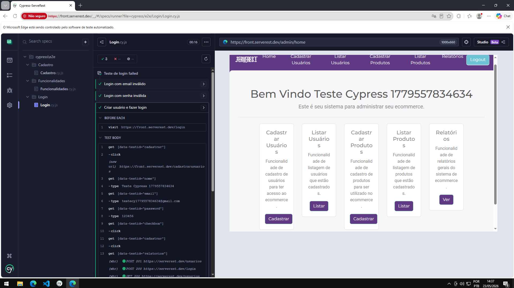
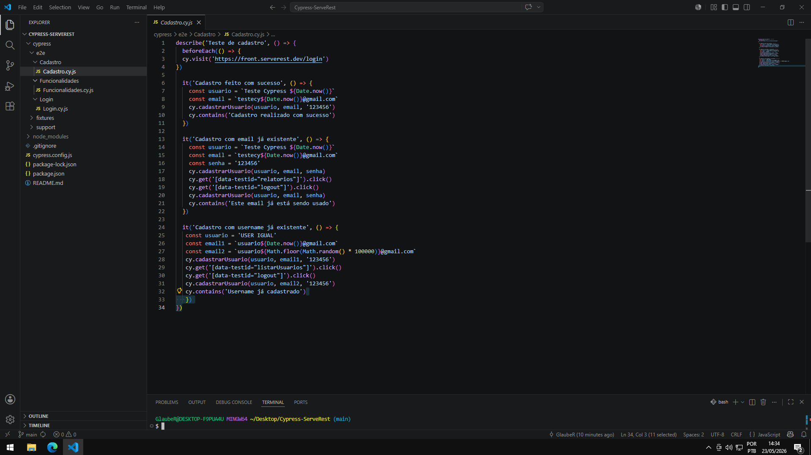
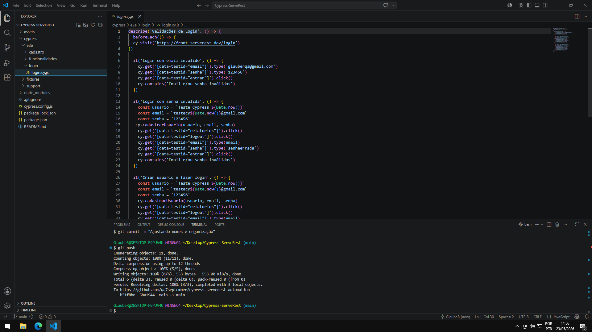
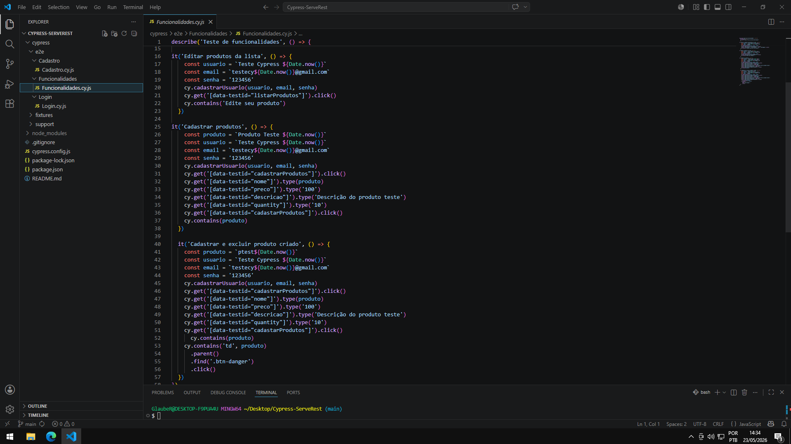
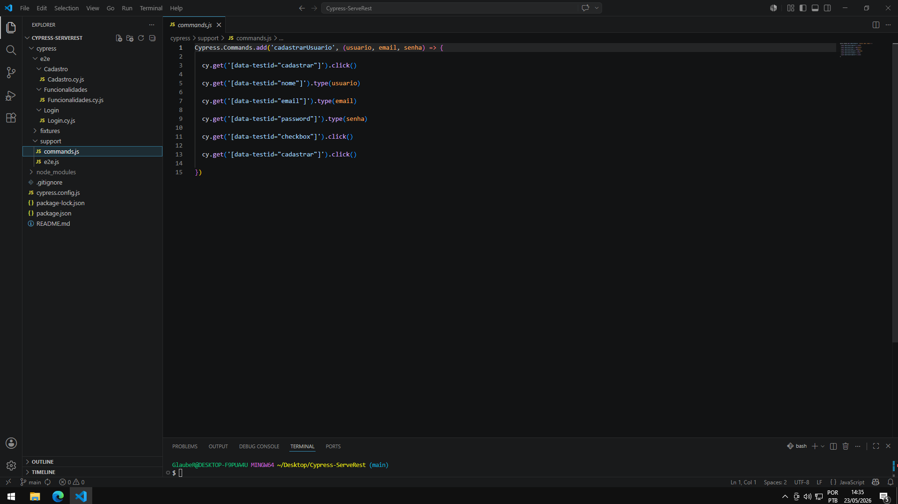

# 🚀 Cypress ServeRest Automation

Projeto de automação de testes End-to-End (E2E) desenvolvido com Cypress utilizando a aplicação ServeRest como ambiente de testes.

Este projeto foi criado com foco em:
- validação de fluxos reais
- automação de funcionalidades críticas
- boas práticas em Cypress
- organização de suíte E2E
- reutilização de código

---

# 📌 Tecnologias utilizadas

- JavaScript
- Cypress
- Node.js

---

# 📂 Estrutura do projeto

```bash
cypress/
 ├── e2e/
 │    ├── cadastro/
 │    ├── funcionalidades/
 │    └── login/
 │
 ├── support/
 │    ├── commands.js
 │    └── e2e.js
 │
 └── fixtures/
```

---

# ✅ Funcionalidades automatizadas

## 👤 Cadastro de usuários
- Cadastro com sucesso
- Cadastro com email já existente
- Cadastro com username já existente

---

## 🔐 Login
- Login com sucesso
- Login com email inválido
- Login com senha inválida
- Logout de usuário

---

## 📦 Produtos
- Cadastro de produtos
- Exclusão de produtos
- Edição de produtos
- Exclusão dinâmica de produtos criados

---

# 📸 Evidências

## Cypress Runner



---

## Cadastro de Usuário



---

## Login Automatizado



---

## Funcionalidades de Produtos



---

## Estrutura e Organização do Projeto



---

# ⚙️ Boas práticas aplicadas

✅ Uso de `beforeEach()`  
✅ Massa dinâmica com `Date.now()`  
✅ Custom Commands (`commands.js`)  
✅ Separação por funcionalidades  
✅ Assertions com `cy.contains()`  
✅ Estrutura organizada e escalável  
✅ Reutilização de código  
✅ Fluxos positivos e negativos  

---

# ▶️ Como executar o projeto

## Instalar dependências

```bash
npm install
```

---

## Executar Cypress em modo visual

```bash
npx cypress open
```

---

## Executar testes em modo headless

```bash
npx cypress run
```

---


# 🎯 Objetivo do projeto

Este projeto foi desenvolvido com o objetivo de praticar automação E2E utilizando Cypress, simulando cenários reais encontrados em aplicações web.

---

# 👨‍💻 Autor

Desenvolvido por QA7September 🚀
